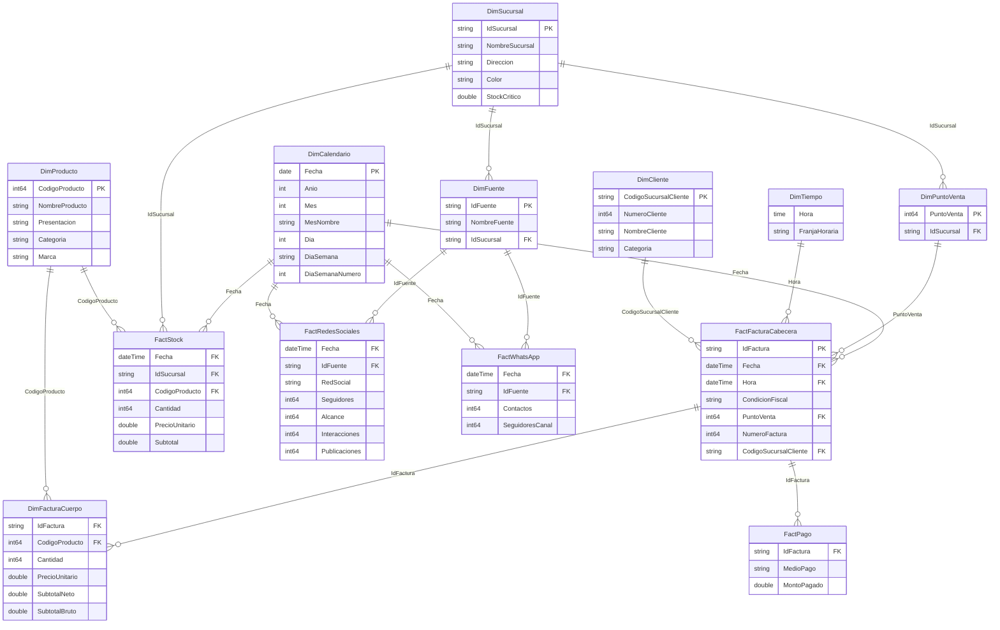
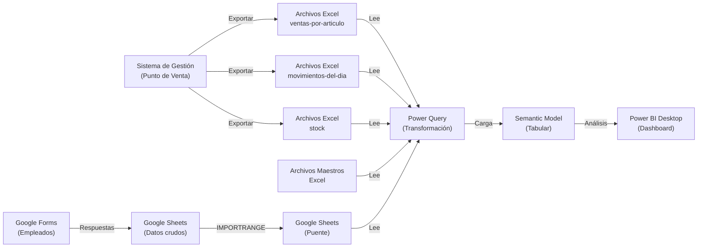

# Queen Helados Dashboard

Un tablero completo de Business Intelligence desarrollado en Power BI para analizar ventas, inventario, estadísticas de redes sociales y WhatsApp de la empresa Queen Helados.

## 📋 Tabla de Contenidos

- [Introducción](#introducción)
- [Requisitos Previos](#requisitos-previos)
- [Instrucciones de Configuración](#instrucciones-de-configuración)
- [Estructura del Proyecto](#estructura-del-proyecto)
- [Estructura de Datos](#estructura-de-datos)
- [Características Principales](#características-principales)
- [Modelo de Datos](#modelo-de-datos)
- [Flujo de Datos](#flujo-de-datos)
- [Uso del Dashboard](#uso-del-dashboard)
- [Notas Importantes](#notas-importantes)

## Introducción

El **Queen Helados Dashboard** es un proyecto Power BI (PBIP - Power BI Project) que proporciona análisis integral del negocio. El dashboard integra datos de múltiples fuentes:

- **Ventas detalladas** por producto, sucursal, cliente y período
- **Inventario valorizado** en tiempo real de cada sucursal
- **Estadísticas de redes sociales** (Instagram, Facebook, TikTok)
- **Estadísticas de WhatsApp** (contactos, seguidores del canal)
- **Análisis de pagos** por medio de pago y cliente

El proyecto utiliza un modelo de datos dimensional (esquema estrella) que facilita análisis rápidos y eficientes.

## Requisitos Previos

- Acceso a **Power BI Desktop**
- Acceso a **Excel** (para actualizar archivos de configuración)
- Acceso a **Google Sheets** (para estadísticas de redes sociales y WhatsApp)
- **Carpeta de datos** con la estructura especificada (ver [Estructura de Datos](#estructura-de-datos))

## Instrucciones de Configuración

### 1. Abrir el Proyecto en Power BI

1. Abre Power BI Desktop
2. Selecciona **Archivo > Abrir** y navega a `queenhelados-dashboard.pbip`
3. Power BI abrirá el proyecto completo con el modelo semantic y los reportes

### 2. Configurar la Ruta de Datos

1. En Power BI Desktop, ve a **Inicio > Transformar datos > Editar parámetros**
2. Busca el parámetro **`SourceFolder`**
3. Actualiza el valor con la ruta absoluta a tu carpeta de datos (por ejemplo, `C:\Users\Usuario\Documents\QueenHelados\Datos\`)

### 3. Actualizar los Datos

1. En Power BI Desktop, haz clic en **Inicio > Actualizar**
2. El modelo cargará automáticamente todos los datos de las carpetas configuradas

## Estructura del Proyecto

### Estructura del Power BI Project (PBIP)

```text
queenhelados-dashboard/
├── dashboard.Report/                      # Reporte, páginas y visuales
│   ├── .pbi/
│   ├── definition/
│   │   ├── pages/                         # Páginas del reporte
│   │   │   ├── [PageID]/
│   │   │   │   ├── visuals/               # Visuales de cada página
│   │   │   │   │   └── [VisualID]/
|   |   |   |   |       └── visual.json    # Configuración de visual
│   │   │   │   └── page.json              # Configuración de página
│   │   │   └── pages.json                 # Índice de páginas
│   │   ├── report.json                    # Configuración del reporte
│   │   └── version.json
│   ├── StaticResources/
│   │   └── SharedResources/
│   │       └── BaseThemes/
│   │           └── CY25SU12.json          # Tema personalizado
│   └── definition.pbir
├── dashboard.SemanticModel/               # Modelo de datos
│   ├── .pbi/
│   ├── definition/
│   │   ├── cultures/
│   │   │   └── en-US.tmdl
│   │   ├── tables/                        # Definición de tablas
│   │   │   └── [TableName].tmdl
│   │   ├── database.tmdl
│   │   ├── expressions.tmdl               # Parámetros y queries ocultas
│   │   ├── model.tmdl
│   │   └── relationships.tmdl             # Relaciones entre tablas
│   ├── .platform
│   ├── definition.pbism
│   └── diagramLayout.json                 # Disposición del diagrama de dominio
├── dashboard.pbip                         # Archivo principal del proyecto
└── README.md                              # Este archivo
```

## Estructura de Datos

### Estructura de carpetas

El parámetro `SourceFolder` debe apuntar a una carpeta que contenga las siguientes subcarpetas y archivos.

```text
SourceFolder/
├── movimientos-del-dia/
│   ├── 20260315-escobar.XLS
│   ├── 20260315-pilar.XLS
│   └── ...
├── stock/
│   ├── 20260315-escobar.XLS
│   ├── 20260315-pilar.XLS
│   └── ...
├── ventas-por-articulo/
│   ├── 20260301-20260307-escobar.XLS
│   ├── 20260315-pilar.XLS
│   └── ...
├── fuentes.xlsx
├── productos.xlsx
├── puntos-de-venta.xlsx
└── sucursales.xlsx
```

### 1. Movimientos del Día (`movimientos-del-dia/`)

Estos archivos son exportados del sistema de gestión en **Movimientos de caja/banco > Movimientos del día**, y contienen el listado completo de las transacciones del día de la sucursal.

> [!NOTE]
> Este archivo también contiene información no utilizada por el dashboard, como los recibos, las órdenes de pago, y los movimientos internos de mercadería con otras sucursales y el kiosco.

La **nomenclatura** para estos archivos es `aaaammdd-sucursal.XLS`, por ejemplo `20260315-garin.XLS`.

| Columna                    | Tipo    | Descripción                        |
| -------------------------- | ------- | ---------------------------------- |
| Tipo de documento          | Texto   | FAC., RBO., O.P., etc.             |
| Condición fiscal           | Texto   | B o N                              |
| Punto de venta             | Número  | 5 dígitos, ej: 00023               |
| Número de documento        | Número  | 8 dígitos, ej: 00014937            |
| Número de cliente          | Número  | MAX 9999                           |
| Nombre del cliente         | Texto   | Nombre del cliente                 |
| Importe (contado)          | Decimal | Solo para FAC. al contado          |
| Medio de pago              | Texto   | Efectivo, Mercado Pago, etc.       |
| Importe (cuenta corriente) | Decimal | Solo para FAC. en cuenta corriente |
| Ingresos                   | Decimal | Solo para recibos (RBO.)           |
| Egresos                    | Decimal | Solo para órdenes de pago (O.P.)   |

> [!WARNING]
> Solo una de las columnas importe/ingresos/egresos tiene valor por fila, según el tipo de documento.

### 2. Stock Valorizado (`stock/`)

Estos archivos son exportados del sistema de gestión en **Submenú de Archivos > Listado de stock valorizado**, y contienen el stock de cada producto en la sucursal, junto con su precio unitario y el importe total.

La **nomenclatura** para estos archivos es `aaaammdd-sucursal.XLS`, por ejemplo `20260228-escobar.XLS`.

| Columna                  | Tipo    | Descripción                    |
| ------------------------ | ------- | ------------------------------ |
| Código del producto      | Número  | Código del producto en sistema |
| Descripción del artículo | Texto   | Nombre del producto en sistema |
| Stock actual             | Decimal | Cantidad disponible            |
| Precio                   | Decimal | Precio unitario                |
| Importe total            | Decimal | Stock actual × Precio          |

### 3. Archivos de Ventas Diarias (`ventas-por-articulo/`)

Estos archivos son exportados del sistema de gestión en **Submenú de Ventas > Detalle de ventas por artículo**, y contienen el detalle de todos los artículos vendidos en la sucursal durante el período seleccionado.

La **nomenclatura** para estos archivos es `aaaammdd-sucursal.XLS` para ventas de un solo día, o `aaaammdd-aaaammdd-sucursal.XLS` para ventas de un rango de fechas. Por ejemplo, `20260315-pilar.XLS` o `20260301-20260307-escobar.XLS`.

| Columna                  | Tipo    | Descripción                       |
| ------------------------ | ------- | --------------------------------- |
| Fecha de la venta        | Fecha   | dd/mm/aaaa                        |
| Hora de la venta         | Hora    | hh:mm                             |
| Código del producto      | Número  | Código del producto en sistema    |
| Descripción del artículo | Texto   | Nombre del producto en sistema    |
| Cantidad vendida         | Decimal | Unidades vendidas                 |
| Precio de venta          | Decimal | Precio unitario (ver nota de IVA) |
| Importe total            | Decimal | Cantidad × Precio                 |
| Tipo de documento        | Texto   | FAC. (factura)                    |
| Condición fiscal         | Texto   | B (Factura B) o N (Negro)         |
| Punto de venta           | Número  | 5 dígitos, ej: 00023              |
| Número de documento      | Número  | 8 dígitos, ej: 00014937           |
| Número de cliente        | Número  | MAX 9999                          |
| Nombre del cliente       | Texto   | Nombre del comprador              |

> [!IMPORTANT]
> Para ventas en B, el "Precio de venta" está **sin IVA** (÷1.21). Para ventas en N, incluye el IVA. El modelo calcula automáticamente subtotal bruto y neto.
>
> Por ejemplo, para un producto con un precio de venta de $10.000, una venta en N mostrará un precio unitario de $10.000, mientras que una en B mostrará $8.264,46.

### 4. Archivo de Productos (`productos.xlsx`)

Catálogo completo de productos y sus características.

| CodigoProducto | NombreProducto          | Presentacion | Categoria | Marca    |
| -------------- | ----------------------- | ------------ | --------- | -------- |
| 1007           | 360 X 12 DULCE DE LECHE | Caja         | Taza      | Acapulco |
| ...            | ...                     | ...          | ...       | ...      |

> [!TIP]
> Solo se deben incluir aquellos productos cuya venta se desea analizar. Si un producto no está en este archivo, no aparecerá en el análisis de la página **Productos**.

### 5. Archivo de Sucursales (`sucursales.xlsx`)

Información de todas las sucursales y sus parámetros.

| IdSucursal | NombreSucursal | Direccion                                             | Color   | Stock Crítico   |
| ---------- | -------------- | -----------------------------------------------       | ------- | -------------   |
| delviso    | Del Viso       | Independencia 6980, Del Viso, Buenos Aires, Argentina | #b4298e | 12.000.000      |
| ...        | ...            | ...                                                   | ...     | ...             |

### 6. Archivo de Puntos de Venta (`puntos-de-venta.xlsx`)

Puntos de venta de cada sucursal.

| PuntoVenta | IdSucursal |
| ---------- | ---------- |
| 21         | escobar    |
| 22         | escobar    |
| 27         | garin      |
| ...        | ...        |

### 7. Archivo de Fuentes (`fuentes.xlsx`)

Entidades digitales (llamadas **fuentes**) que tienen sus propias estadísticas de redes sociales y WhatsApp, y la sucursal a la que corresponden.

| IdFuente   | NombreFuente | IdSucursal |
| ---------- | ------------ | ---------- |
| pilar      | Pilar        | pilar      |
| escobar    | Escobar      | escobar    |
| repartos   | Repartos     | escobar    |
| punto-frio | Punto Frío   | escobar    |
| ...        | ...          | ...        |

### 8. Google Sheets para Redes Sociales y WhatsApp

Estadísticas diarias de redes sociales y WhatsAp, almacenadas en Google Sheets a través de un formulario Google Forms.

| Columna               | Descripción                         |
| --------------------- | ----------------------------------- |
| Marca temporal        | Fecha y hora del envío (automática) |
| Fecha                 | Día del reporte                     |
| Sucursal              | Fuente/Entidad digital              |
| **WhatsApp**          |                                     |
| Contactos en WhatsApp | Cantidad total de contactos         |
| Seguidores del canal  | Cantidad de seguidores del canal    |
| **Instagram**         |                                     |
| Seguidores            | Total de seguidores                 |
| Alcance               | Alcance de publicaciones            |
| Interacciones         | Likes, comentarios, compartidos     |
| Publicaciones         | Cantidad de posts                   |
| **Facebook**          |                                     |
| Seguidores            | Total de seguidores                 |
| Alcance               | Alcance de contenido                |
| Interacciones         | Likes, comentarios, compartidos     |
| Publicaciones         | Cantidad de posts                   |
| **TikTok**            |                                     |
| Seguidores            | Total de seguidores                 |
| Alcance               | Visualizaciones totales             |
| Likes                 | Total de likes                      |
| Comentarios           | Total de comentarios                |
| Compartidos           | Total de compartidos                |
| Publicaciones         | Cantidad de videos                  |

## Características Principales

### 1. **Análisis de Ventas**

- Ventas totales por sucursal, producto, cliente, fecha, y más
- Comparativa entre ventas en B (Blanco) y N (Negro)
- Ventas por medio de pago (Efectivo, Tarjeta, etc.)
- Productos de mayor impacto
- Clientes más importantes
- Tendencias de ventas diarias, semanales y mensuales

### 2. **Gestión de Inventario**

- Stock valorizado por sucursal
- Indicadores de stock crítico

### 3. **Estadísticas de Redes Sociales y WhatsApp**

- Crecimiento de seguidores en Instagram, Facebook y TikTok
- Análisis de engagement (alcance e interacciones)
- Cumplimiento del objetivo de publicaciones diarias
- Crecimiento de contactos y seguidores del canal de WhatsApp

## Modelo de Datos

El modelo utiliza una arquitectura de **esquema snowflake** con tablas de dimensiones y hechos:



## Flujo de Datos



### Descripción del Flujo

1. **Extracción de Datos**

   - Sistema de gestión exporta archivos Excel diarios
   - Empleados cargan estadísticas de redes sociales y WhatsApp en Google Forms
   - Respuestas se almacenan automáticamente en Google Sheets

2. **Transformación con Power Query**

   - Lee archivos Excel de ventas, movimientos y stock
   - Lee archivos maestros de productos, sucursales, etc.
   - Lee datos de Google Sheets
   - Limpia, valida e integra los datos

3. **Carga en Modelo Dimensional**

   - Datos transformados se cargan en tablas de dimensiones y hechos
   - Se establecen relaciones entre tablas
   - Se calculan medidas DAX

4. **Análisis y Visualización**
   - Dashboard accede al modelo semántico
   - Crea visuales interactivos
   - Usuarios analizan datos en Power BI Desktop

## Uso del Dashboard

### Páginas Principales

El dashboard contiene múltiples páginas para diferentes análisis:

- **Ventas** - Ventas de cualquier período de tiempo que se desee.
- **Stock** - Stock valorizado de cualquier fecha que se desee.
- **Stock del día** - Stock valorizado solo del día en curso.
- **Ventas del día** - Ventas solo del día en curso.
- **Ventas de la semana** - Ventas solo de la semana anterior.
- **Ventas del mes** - Ventas solo del mes anterior.
- **Clientes** - Mejores clientes según su facturación y cómo se comparan con la facturación a consumidor final y Pedidos Ya.
- **Productos** - Productos más vendidos por categoría, presentación o marca.
- **WhatsApp (semanal)** - Cantidad total y variación de contactos y seguidores del canal de WhatsApp.
- **Redes sociales (semanal)** - Cantidad total y variación de seguidores, además del alcance y las interacciones.
- **Publicaciones (semanal)** - Cuántas publicaciones se subieron en los últimos 7 días y cómo se compara con el objetivo.

### Interacción con Filtros

Todos los visuales están conectados. Al seleccionar elementos como:

- **Sucursal** - Filtra todos los datos a esa sucursal
- **Período (Fecha)** - Filtra por rango de fechas
- **Producto** - Muestra solo ese producto
- **Cliente** - Filtra por cliente específico

Es posible realizar este filtrado con cualquiera de los datos disponibles, lo que permite análisis profundos y personalizados.

### Exportación de Datos

Para la fácil visualización del dashboard, sin necesidad de utilizar Power BI Desktop, es posible exportar todas las páginas no ocultas a un archivo PDF (Archivo > Exportar > Exportar como PDF). Sin embargo, este archivo PDF no es interactivo, por lo que no es posible aplicar filtros o interactuar con los visuales.

También es posible exportar los datos detrás de cada visual a un archivo CSV. Para esto, haz clic en los tres puntos (...) de cualquier visual y selecciona "Exportar datos".

## Notas Importantes

### Actualizaciones de Datos

- **Frecuencia recomendada**: diaria (preferiblemente al final del día)
- **Tiempo de actualización**: aproximadamente 5 minutos según la cantidad de datos

### Archivos Maestros

- **Productos** - Actualizar cuando se agreguen productos nuevos (cambios poco frecuentes)
- **Sucursales** - Actualizar solo si se agrega una sucursal o se modifica su stock crítico (muy raro)
- **Puntos de Venta** - Actualizar solo si se agrega un punto de venta (muy raro)
- **Fuentes** - Actualizar si se agrega una entidad digital (poco frecuente)

### Rendimiento

Si el dashboard se ralentiza, considera la archivación de datos antiguos.
